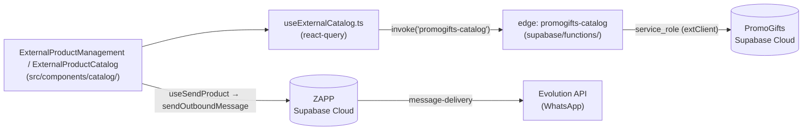

# Catálogo — Arquitetura (E10, retomado na E24)

> Este arquivo deveria ter sido criado na E10 (Fase 0) e atualizado na E24 — nenhum dos dois
> aconteceu na hora certa. Escrito agora (E25), com tudo confirmado por leitura de código e SQL
> direto até aqui (E01–E24), não presumido.

## Fluxo de dados

O catálogo é **somente-leitura** no ZAPP: toda escrita de produto (novo produto, edição,
categorias) acontece no PromoGifts. Decisão tomada na E10 e reafirmada aqui — nenhuma etapa
deste plano cria UI de CRUD de produto no ZAPP.

## Autenticação e credenciais

- Edge exige JWT de usuário logado (`requireAuth`/`localClient.auth.getUser()`), rate limit
  60/min por usuário (`list_products` sobe pra 120/min planejado na E26).
- Credencial do PromoGifts (`PROMOGIFTS_SUPABASE_SERVICE_ROLE_KEY`) só existe em Edge secrets —
  o comentário no próprio código diz por quê: "Catalog tables deliberately deny the external
  anon role."

## Mapa métrica → fonte

| Métrica / dado | Fonte real | Etapa |
|---|---|---|
| Produtos, KPIs (total/estoque/destaque/novidade/mais vendido/kits/estoque baixo) | RPC `public.zapp_catalog_stats()` (PromoGifts, aplicada e testada na E24) | E24 |
| Categorias raiz (27 ativas — **não 28**, achado por SQL: 1 raiz inativa/soft-deleted) | `categories where level=1 and is_active and deleted_at is null` | E24 |
| Fornecedores ativos (4) | `count(distinct supplier_id)` de produtos ativos | E24 |
| Série mensal (gráfico do rail) | `by_month` da mesma RPC, 6 meses + atual | E24 |
| Sincronização (badge "Sincronizado há X") | `last_sync_at`/`last_update_at` da mesma RPC | E24 |
| Busca | `search_vector` (FTS real, `websearch_to_tsquery('portuguese', …)`, termo sem acento) | E23 |
| Filtros avançados (destaque/novidade/kit/personalização/estoque baixo/preço/cor/material/gravação) | `list_products` com os parâmetros da E22 | E22 |
| Categoria + descendentes | `categories.path like '<path>%'` (caminho materializado por uuid) | E22 |
| Campos completos do produto (imagens, swatches, materiais, flags, expirações) | `PRODUCT_FIELDS`/`PRODUCT_FIELDS_COMPACT` (E21) | E21 |
| Categorias/fornecedores enriquecidos (ícone, cor, logo, contagem) | `list_categories`/`list_suppliers` | E25 (em andamento) |
| Favoritos | tabela `catalog_favorites` no ZAPP | E27 (pendente) |
| Log de envios | tabela `catalog_send_events` no ZAPP | E28 (pendente) |

## Riscos conhecidos (registrados, não ignorados)

- **Rate limit:** abrir a tela hoje dispara `list_products` + `list_categories` + `list_suppliers`
  + `catalog_stats` — 4 chamadas. A E26 (`bootstrap`) junta categorias/fornecedores/stats numa
  chamada só.
- **`relevance` como ordenação real** (por `ts_rank_cd`) não existe — decidido na E23 não fingir
  essa opção; exigiria uma RPC de rank dedicada, fora do escopo atual.
- **`color`/`material`:** ~4% dos valores de `colors`/`materials` (fornecedor XBZ) são objetos
  `{nome, swatch_url}` em vez de string simples — tratado com `contains` cobrindo os dois
  formatos (E22), mas qualquer novo filtro sobre esses campos precisa lembrar disso.
- **Sem validação automatizada de sintaxe Deno** para `supabase/functions/**` neste ambiente
  (sem `deno`, `tsconfig.app.json` não inclui a pasta, CI só roda `deno test` numa lista fixa de
  arquivos que não inclui `promogifts-catalog`) — achado nas E22/E23, registrado lá também. A
  única validação real acontece no deploy.
- **Envio real nunca testado ponta a ponta** (E08): mediaUrl externo confirmado por leitura de
  código (`resolvePrivateBucketUrl` deixa passar sem re-upload), mas sem confirmação empírica via
  WhatsApp real — falta sessão de usuário logado neste ambiente e a apikey do MCP `EVO API - MCP`
  está inválida pra instância `wpp2` (achado, não corrigido — fora do escopo do Catálogo).
