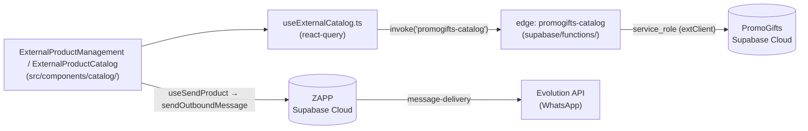

# Catálogo — Arquitetura (E10, retomado na E24; corrigido na E25/CT-98)

> Este arquivo deveria ter sido criado na E10 (Fase 0) e atualizado na E24 — nenhum dos dois
> aconteceu na hora certa. Escrito na E25, com tudo confirmado por leitura de código e SQL
> direto até ali (E01–E24), não presumido. **Corrigido em 02/10/2026 (CT-98):** os números
> foram datados com a fonte, as marcações "pendente" de favoritos/send_events removidas
> (ambos existem hoje) e a view `catalog_send_stats` acrescentada.

## Fluxo de dados

```mermaid
flowchart LR
  UI["ExternalProductManagement / ExternalProductCatalog\n(src/components/catalog/)"]
  Hook["useExternalCatalog.ts\n(react-query)"]
  Edge["edge: promogifts-catalog\n(supabase/functions/)"]
  ExtDB[("PromoGifts\nSupabase Cloud")]
  ZappDB[("ZAPP\nSupabase Cloud")]
  Evo["Evolution API\n(WhatsApp)"]

  UI --> Hook
  Hook -->|"invoke('promogifts-catalog')"| Edge
  Edge -->|"service_role (extClient)"| ExtDB
  UI -->|"useSendProduct → sendOutboundMessage"| ZappDB
  ZappDB -->|"message-delivery"| Evo
```

O catálogo é **somente-leitura** no ZAPP: toda escrita de produto (novo produto, edição,
categorias) acontece no PromoGifts. Decisão tomada na E10 e reafirmada aqui — nenhuma etapa
deste plano cria UI de CRUD de produto no ZAPP.

**Fluxo único de envio (CT-13, bloco B — 29/09).** Antes do bloco B, o chat montava uma
mensagem de texto própria (sem foto, sem caption, sem log em `catalog_send_events`). Hoje o
chat e a tela de catálogo abrem o **mesmo** `SendProductDialog`
(`src/components/catalog/SendProductDialog.tsx`), com `presetContact` = contato da conversa;
a escrita é uma só, via `useSendProduct → sendOutboundMessage`, com log em
`catalog_send_events` (E28) e progresso "Enviando N/M…".

## Autenticação e credenciais

- Edge exige JWT de usuário logado (`requireAuth`/`localClient.auth.getUser()`), rate limit
  60/min por usuário (`list_products` sobe pra 120/min planejado na E26).
- Credencial do PromoGifts (`PROMOGIFTS_SUPABASE_SERVICE_ROLE_KEY`) só existe em Edge secrets —
  o comentário no próprio código diz por quê: "Catalog tables deliberately deny the external
  anon role."

## Mapa métrica → fonte

| Métrica / dado | Fonte real | Etapa |
|---|---|---|
| Produtos ativos (**7.722** em 29/09/2026; era 7.576 em 11/09 — `AUDITORIA_CATALOGO_2026-09-29.md:55`) | RPC `public.zapp_catalog_stats()` (PromoGifts) | E24 |
| KPIs (total/estoque/destaque/novidade/mais vendido/kits/estoque baixo) | mesma RPC (PromoGifts, aplicada e testada na E24) | E24 |
| Ordenação "Mais pedidos" | `order_count` — **0 em 100% dos produtos, medido em 29/09/2026** (`AUDITORIA…:53`); por isso a opção fica oculta (CT-22) | E24 |
| Categorias raiz (27 ativas — **não 28**, achado por SQL na E24/24-09-2026: 1 raiz inativa/soft-deleted) | `categories where level=1 and is_active and deleted_at is null` | E24 |
| Fornecedores ativos (4, medido na E24) | `count(distinct supplier_id)` de produtos ativos | E24 |
| Série mensal (gráfico do rail) | `by_month` da mesma RPC, 6 meses + atual | E24 |
| Sincronização (badge "Sincronizado há X") | `last_sync_at`/`last_update_at` da mesma RPC — **sync parado desde 05/09/2026** (24 dias sem atualização em 29/09; `AUDITORIA…:52`) | E24 |
| Busca | `search_vector` (FTS real, `websearch_to_tsquery('portuguese', …)`, termo sem acento) | E23 |
| Filtros avançados (destaque/novidade/kit/personalização/estoque baixo/preço/cor/material/gravação) | `list_products` com os parâmetros da E22 | E22 |
| Categoria + descendentes | `categories.path like '<path>%'` (caminho materializado por uuid) | E22 |
| Campos completos do produto (imagens, swatches, materiais, flags, expirações) | `PRODUCT_FIELDS`/`PRODUCT_FIELDS_COMPACT` (E21) | E21 |
| Categorias/fornecedores enriquecidos (ícone, cor, logo, contagem) | `list_categories`/`list_suppliers` | E25 |
| Favoritos | tabela `catalog_favorites` no ZAPP — **implementada** (migration `20260913013153_catalog_favorites.sql`; `CatalogFavoritesTab`/`useCatalogFavorites`) | E27 ✅ |
| Log de envios | tabela `catalog_send_events` no ZAPP — **implementada** (migration `20260913122557_catalog_send_events.sql`; `ContactSelectionStep`/`useCatalogRecentSends`) | E28 ✅ |
| Estatísticas de envio (por dia 30d / agente / produto + taxas) | view `public.catalog_send_stats` (`security_invoker=on`) — migration `20260930740000_catalogo_send_stats.sql`; `supabase/schema-manifest.json:172` | E28/CT-48 ✅ |

Os valores datados acima são **medições pontuais** do PromoGifts em 29/09/2026 (`AUDITORIA_CATALOGO_2026-09-29.md`), não constantes — a RPC `zapp_catalog_stats()` é viva.

## Riscos conhecidos (registrados, não ignorados)

- **Rate limit:** abrir a tela hoje dispara `list_products` + `list_categories` + `list_suppliers`
  + `catalog_stats` — 4 chamadas. A E26 (`bootstrap`) junta categorias/fornecedores/stats numa
  chamada só.
- **`relevance` como ordenação real** (por `ts_rank_cd`) não existe — decidido na E23 não fingir
  essa opção; exigiria uma RPC de rank dedicada, fora do escopo atual.
- **`color`/`material`:** ~4% dos valores de `colors`/`materials` (fornecedor XBZ) são objetos
  `{nome, swatch_url}` em vez de string simples — tratado com `contains` cobrindo os dois
  formatos (E22), mas qualquer novo filtro sobre esses campos precisa lembrar disso.
- **Sem validação automatizada de sintaxe Deno** para `supabase/functions/**` neste ambiente
  (sem `deno`, `tsconfig.app.json` não inclui a pasta, CI só roda `deno test` numa lista fixa de
  arquivos que não inclui `promogifts-catalog`) — achado nas E22/E23, registrado lá também. A
  única validação real acontece no deploy.
- **Envio real nunca testado ponta a ponta** (E08; **confirmado ainda em aberto em 29/09/2026**):
  `catalog_send_events` = **0 linhas** e `messages` com `imagedelivery.net` = **0** em 29/09
  (`AUDITORIA_CATALOGO_2026-09-29.md:51`, F1) — nenhum envio real de produto aconteceu em
  produção. O `mediaUrl` externo está confirmado só por leitura de código
  (`resolvePrivateBucketUrl` deixa passar sem re-upload), sem confirmação empírica via WhatsApp
  real: falta sessão de usuário logado neste ambiente e a apikey do MCP `EVO API - MCP` está
  inválida pra instância `wpp2` (achado, não corrigido — fora do escopo do Catálogo).
