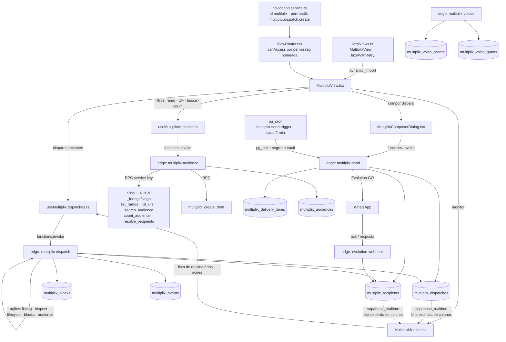
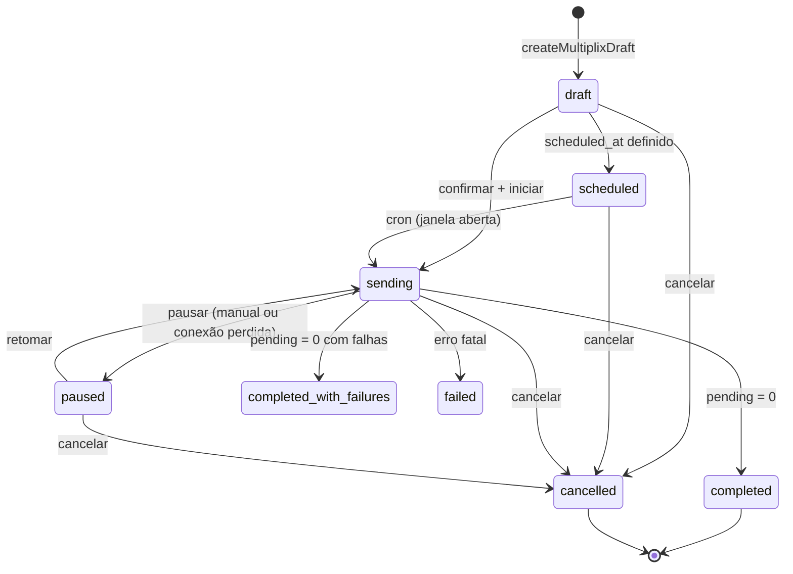

# Multiplix — Arquitetura do Módulo

> Retrato do código em **2026-10-08** (ponta de dia). Fontes conferidas: `src/pages/lazyViews.ts`,
> `src/pages/ViewRouter.tsx`, `src/services/navigation.service.ts`, `src/components/multiplix/`,
> `src/hooks/integrations/useMultiplix*.ts`, `supabase/functions/multiplix-*/.` e as migrations
> `*multiplix*.sql`. Este é o mapa do que **existe** — o plano de 100 etapas é a intenção, não a prova.

## Diagrama de Componentes

## Métrica → Fonte de Dado

Toda métrica da tela sai de uma fonte real. A coluna "Fonte" cita a tabela, a RPC ou a edge exata — nada
de número inventado no front.

| Métrica exibida | Onde aparece | Fonte real |
|---|---|---|
| Empresas no filtro atual | `MultiplixView` (`count.data`) | edge `multiplix-audience` → RPC Singu `multiplix_count_audience` |
| Ramos e UFs disponíveis | `MultiplixView` (selects) | edge `multiplix-audience` → RPCs Singu `multiplix_list_ramos`, `multiplix_list_ufs` |
| Linhas da audiência (empresa, ramo, UF, destino) | `MultiplixView` (tabela) | edge `multiplix-audience` → RPC Singu `multiplix_search_audience` |
| Destino/aptidão de cada empresa | `MultiplixView` (coluna Destino) | RPC Singu `multiplix_resolve_recipients` → `multiplix_recipients.destino_origem`, `eligibility` |
| Disparos recentes e status | `MultiplixView` ("Disparos recentes") | edge `multiplix-dispatch` (listing) → `multiplix_dispatches.status` |
| Enviadas / total do disparo | `MultiplixView`, `MultiplixMonitor` | `multiplix_dispatches.sent_count`, `total_recipients` |
| Progresso (%) e restantes | `MultiplixMonitor` | `multiplix_dispatches` (contadores) + contagem de `multiplix_recipients.status = skipped` |
| Falhas e "a confirmar" | `MultiplixMonitor` | `multiplix_dispatches.failed_count`, `outcome_unknown_count` |
| Lista de destinatários por status | `MultiplixMonitor` | edge `multiplix-dispatch` (inspect) → `multiplix_recipients.status` |
| Atualização ao vivo do monitor | `MultiplixMonitor` (postgres_changes) | `supabase_realtime` em `multiplix_dispatches` e `multiplix_recipients` |
| Motivo da pausa | `MultiplixMonitor` | `multiplix_dispatches.pause_reason` |
| Envio travado / drenagem | worker `multiplix-send` | `multiplix_delivery_items` (lease) e `multiplix_events` |
| Vozes IA disponíveis e concessões | edge `multiplix-voices` | `multiplix_voice_assets`, `multiplix_voice_grants` |
| **NÃO mostrar** | — | Sem métrica de ROI/clique: `multiplix_links`/`multiplix_conversions` **não existem** no Multiplix |

## Tela → Componente → Etapa

| Tela | Componente principal | Etapas |
|---|---|---|
| Audiência + disparos recentes | `MultiplixView.tsx` | A–E (F01–F29) |
| Compor disparo (mensagem, blocos, público) | `MultiplixComposerDialog.tsx` | Fase de conteúdo (F30–F35) |
| Monitor do disparo (progresso, destinatários, pausar/retomar/cancelar) | `MultiplixMonitor.tsx` | Fase de fila e ciclo de vida (F40–F53) |

## Máquina de Estados do Disparo

## Convenções

- **Rota:** `?view=multiplix` → `ViewRouter` → `NavigationService.canAccess` (permissão nomeada, não papel).
- **Padrões herdados do Talk X:** `ModuleHeader`/`StatusPill`/`fmtInt` de `@/components/talkx/talkxShared`,
  primitivos de `src/components/ui/`. Nenhum componente de UI novo (ver `DESIGN_TOKENS_MAP.md`).
- **Canal:** Evolution GO, sem template nem janela 24 h — capacidades em `CANAL.md`.
- **Ponte com o Singu:** chave de serviço do lado de lá, nunca `anon` — em `PONTE_SINGU.md` e `PERMISSOES.md`.
