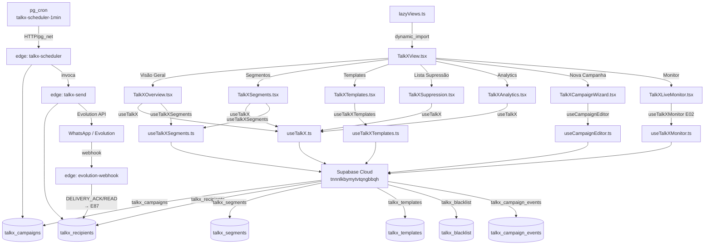
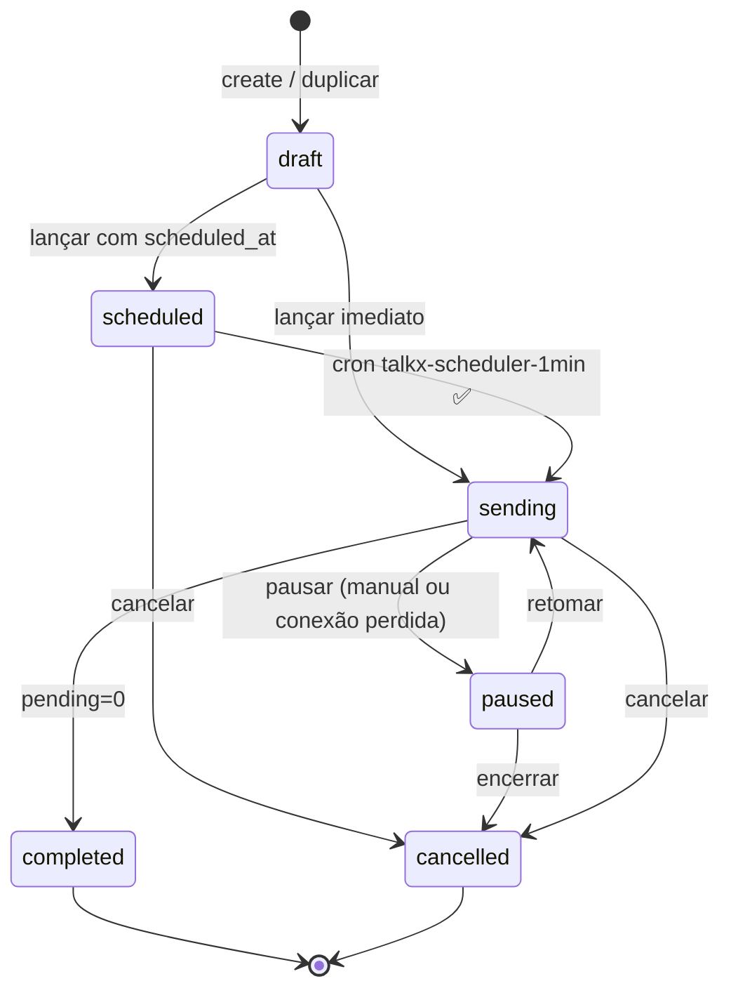

# Talk X · Campanhas — Arquitetura do Módulo

> Gerado em 2026-09-08 · Commit base: `80f139c6` · Graphify: 12.097 nodes

---

## Diagrama de Componentes



---

## Métrica → Fonte de Dado

| Métrica exibida | Fonte real | Etapa que libera |
|---|---|---|
| Enviadas / Falhas / Progresso | `talkx_recipients.status`, `sent_at`; `talkx_campaigns.sent_count/failed_count` | **existe** |
| Contatos alcançados | `count(distinct contact_id) where sent_at is not null` | **existe** |
| Ritmo de entrega (gráfico) | `rateByMinute` via `useTalkXMonitor` → `talkx_recipients.sent_at` | **E02 ✅** |
| Elapsed (timer ao vivo) | `useEffect + setInterval` → sem `Date.now()` no render | **E02 ✅** |
| Entregues / Lidas | `talkx_recipients.delivered_at / read_at` via `external_id` + webhook | E87 |
| Respondidas / Taxa / Tempo médio | `talkx_recipients.replied_at` | E88 |
| Cliques / Conversões / ROI | `talkx_links`, `talkx_link_clicks`, `talkx_conversions` | E90 |
| Opt-outs / Suprimidos / LGPD | `talkx_blacklist_active.reason_code` | E51, E57 |
| Campanhas protegidas | `talkx_campaigns.respect_suppression` | E63 |
| vs. média / benchmarks | `talkx_campaign_metrics` + `talkx_benchmarks()` | E89 |
| Fila por segmento | `talkx_campaign_segments` | E75 |
| Insights / IA | heurísticas reais (rótulo "Insights"); IA só com flag | E92 |
| **NÃO implementar** | Homens/Mulheres, RFM, "+32% engajamento", "Média de 8.1k" | — |

---

## Tela → Componente → Etapa

| Tela (mock) | Componente principal | Etapas chave |
|---|---|---|
| 01 Visão geral | `TalkXOverview.tsx` | E13, E14, E17, E18, E21–E30 |
| 02 Segmentos biblioteca | `TalkXSegments.tsx` | E31, E32, E36, E89 |
| 03 Segmentos criar | `TalkXSegmentBuilder.tsx` | E33–E35, E37–E39 |
| 04 Templates biblioteca | `TalkXTemplates.tsx` | E41, E42, E48 |
| 05 Templates editor | `TalkXTemplateEditor.tsx` | E43–E47, E49 |
| 06 Lista supressão | `TalkXSuppression.tsx` | E51–E59 |
| 07 Analytics | `TalkXAnalytics.tsx` | E21, E86, E89, E90, E92 |
| 08 Nova campanha | `TalkXCampaignWizard.tsx` | E61–E64, E66, E68 |
| 09 Revisão final | `TalkXWizardDelivery.tsx` (`TalkXWizardReview`) | E67 |
| 10 Campanha agendada | `TalkXCampaignScheduled.tsx` (novo) | E69, E71 |
| 11 Monitor ao vivo | `TalkXLiveMonitor.tsx` | **E02 ✅**, E73–E76, E91, E92 |
| 12 Em andamento | `TalkXCampaignRunning.tsx` (novo) | E77, E78 |
| 13 Pausada/retomada | `TalkXCampaignPaused.tsx` (novo) | E79–E81 |
| 14 Relatório concluída | `TalkXCampaignReport.tsx` (novo) | E82–E85, E90 |
| 15 Importação/CRM 360 | `TalkXImport.tsx` (novo) | E94, E95 |
| 16 Ajuda | `TalkXHelp.tsx` (novo) | E96 |
| 17 Estados e modais | todos os `TalkX*.tsx` | E19, E97 |

---

## Máquina de Estados das Campanhas



---

## Convenção de Branch / Commit por Fase

```
feat/talkx-f0-remaining   E07–E10 (este branch)
feat/talkx-f1-design      E11–E20
feat/talkx-f2-overview    E21–E30
feat/talkx-f3-segments    E31–E40
feat/talkx-f4-templates   E41–E50
feat/talkx-f5-suppression E51–E60
feat/talkx-f6-wizard      E61–E70
feat/talkx-f7-lifecycle   E71–E85
feat/talkx-f8-backend     E86–E93
feat/talkx-f9-release     E94–E100
```

Commit format: `feat(talkx): E<NN> <título>` — `gate: tsc=0, ratchet=0` ao final de cada fase.
